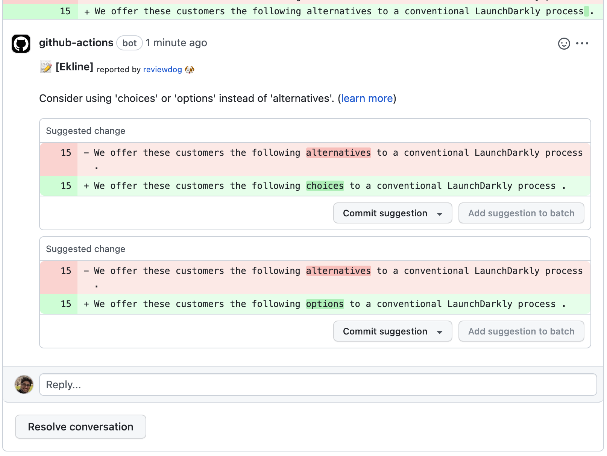

# EkLine GitHub Action

[](https://github.com/ekline-io/ekline-github-action/actions?query=workflow%3ATest)
[](https://github.com/ekline-io/ekline-github-action/actions?query=workflow%3Arelease)
[](https://github.com/ekline-io/ekline-github-action/releases)
[](https://github.com/ekline-io/ekline-cli/pkgs/container/ekline-cli)

Improve the quality and consistency of your documentation with EkLine, an automated review tool for your GitHub repositories. This action integrates seamlessly with your existing GitHub workflow, allowing you to maintain high-quality documentation easily.


<!-- TOC -->
* [EkLine GitHub action](#ekline-github-action)
  * [Input](#input)
  * [Usage](#usage)
  * [Reporters](#reporters)
    * [Reporter: GitHub Checks (reporter: github-pr-check)](#reporter--github-checks--reporter--github-pr-check-)
    * [Reporter: GitHub Checks (reporter: github-check)](#reporter--github-checks--reporter--github-check-)
    * [Reporter: GitHub PullRequest review comment (reporter: github-pr-review)](#reporter--github-pullrequest-review-comment--reporter--github-pr-review-)
  * [Filter mode](#filter-mode)
    * [`added` (default)](#added--default-)
    * [`diff_context`](#diffcontext)
    * [`file`](#file)
    * [`nofilter`](#nofilter)
    * [Filter Mode Support Table](#filter-mode-support-table)
    * [Ignoring Specific Rules](#ignoring-specific-rules)
<!-- TOC -->
* [EkLine Documentation](https://ekline.notion.site/EkLine-Documentation-820e545d76214d9d9cb2cbf627c19613)

## Input

```yaml
inputs:
  content_dir:
    description: 'Content directory relative to the root directory.'
    default: '.'
  ek_token:
    description: 'Token for EkLine application'
    required: true
  filter_mode:
    description: |
      Filtering mode for the EkLine reviewer command [added,diff_context,file,nofilter].
      Default is added.
    default: 'added'
  github_token:
    description: 'GITHUB_TOKEN'
    default: '${{ secrets.github_token }}'
  reporter:
    description: 'Reporter of EkLine review command [github-pr-check,github-check,github-pr-review].'
    default: 'github-pr-check'
  ignore_rule:
    description: 'Ignore the rules that are passed in as comma-separated values (eg: EK00001,EK00004). Use this flag to skip specific rules during the review process.'
    default: ''
  debug:
    description: 'Enable debug mode to print all environment variables starting with INPUT_ when set to true.'
    default: 'false'
```

## Usage

```yaml
name: EkLine
on:
  push:
    branches:
      - master
      - main
  pull_request:
jobs:
  test-pr-review:
    if: github.event_name == 'pull_request'
    name: runner / EkLine Reviewer (github-pr-review)
    runs-on: ubuntu-latest
    steps:
      - uses: actions/checkout@v3
      - uses: ekline-io/ekline-github-action@v6
        with:
          content_dir: ./src/docs
          ek_token: ${{ secrets.ek_token }}
          github_token: ${{ secrets.github_token }}
          reporter: github-pr-review
          ignore_rule: "EK00010,EK00003"  # Optional
```

## Reporters

EkLine reviewer can report results in review services as
continuous integration.

### Reporter: GitHub Checks (reporter: github-pr-check)

github-pr-check reporter reports results to [GitHub Checks](https://help.github.com/articles/about-status-checks/).

### Reporter: GitHub Checks (reporter: github-check)

It's basically same as `reporter: github-pr-check` except it works not only for
Pull Request but also for commit.

### Reporter: GitHub PullRequest review comment (reporter: github-pr-review)



github-pr-review reporter reports results to GitHub PullRequest review comments
using GitHub Personal API Access Token.
[GitHub Enterprise](https://enterprise.github.com/home) is supported too.

- Go to https://github.com/settings/tokens and generate new API token.
- Check `repo` for private repositories or `public_repo` for public repositories.


## Filter mode
You can control how EkLine reviewer filter results by `-filter-mode` flag.
Available filter modes are as below.

### `added` (default)
Filter results by added/modified lines.
### `diff_context`
Filter results by diff context. i.e. changed lines +-N lines (N=3 for example).
### `file`
Filter results by added/modified file. i.e. EkLine reviewer will report results as long as they are in added/modified file even if the results are not in actual diff.
### `nofilter`
Do not filter any results. Useful for posting results as comments as much as possible and check other results in console at the same time.

### Filter Mode Support Table
Note that not all reporters provide full support of filter mode due to API limitation.
e.g. `github-pr-review` reporter uses [GitHub Review
API](https://developer.github.com/v3/pulls/reviews/) but it doesn't support posting comment outside diff (`diff_context`),
so EkLine reviewer will use [Check annotation](https://developer.github.com/v3/checks/runs/) as fallback to post those comments [1].

| `reporter` \ `filter-mode` | `added` | `diff_context` | `file`                  | `nofilter` |
| -------------------------- | ------- | -------------- | ----------------------- | ---------- |
| **`github-check`**         | OK      | OK             | OK                      | OK |
| **`github-pr-check`**      | OK      | OK             | OK                      | OK |
| **`github-pr-review`**     | OK      | OK             | Partially Supported [1] | Partially Supported [1] |

- [1] Report results which is outside diff context with Check annotation as fallback if it's running in GitHub actions instead of Review API (comments). All results will be reported to console as well.

### Ignoring Specific Rules

To ignore specific rules during the review process, you can use the `ignore_rule` flag. This flag accepts a comma-separated list of rule identifiers that you wish to skip.

For example, if you want to ignore rules `EK00001` and `EK00004`, you can set the `ignore_rule` flag in your configuration like this:
```yaml
  ignore_rule: "EK00001,EK00004"