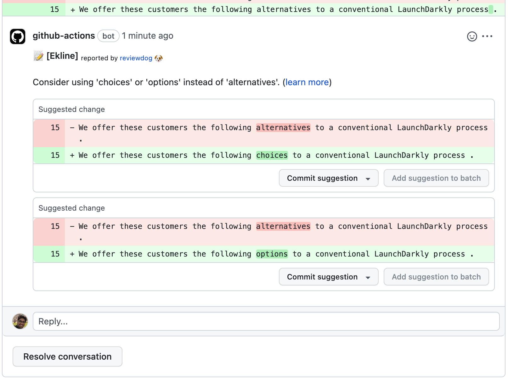

# EkLine GitHub Action

[](https://github.com/ekline-io/ekline-github-action/actions?query=workflow%3ATest)
[](https://github.com/ekline-io/ekline-github-action/actions?query=workflow%3Arelease)
[](https://github.com/ekline-io/ekline-github-action/releases)
[](https://github.com/ekline-io/ekline-cli/pkgs/container/ekline-cli)

Improve the quality and consistency of your documentation with EkLine, an automated review tool for your GitHub repositories. This action integrates with your existing GitHub workflow so you can keep documentation accurate and consistent on every pull request.

<!-- TOC -->
* [EkLine GitHub Action](#ekline-github-action)
  * [Documentation](#documentation)
  * [Inputs](#inputs)
  * [Usage](#usage)
  * [Reporters](#reporters)
    * [`github-pr-check`](#github-pr-check)
    * [`github-check`](#github-check)
    * [`github-pr-review`](#github-pr-review)
  * [Filter mode](#filter-mode)
    * [`added` (default)](#added-default)
    * [`diff_context`](#diff_context)
    * [`file`](#file)
    * [`nofilter`](#nofilter)
    * [Filter mode support](#filter-mode-support)
  * [Ignoring specific rules](#ignoring-specific-rules)
<!-- TOC -->

## Documentation

For complete documentation, see [docs.ekline.io](https://docs.ekline.io).

## Inputs

| Input | Description | Required | Default |
| --- | --- | --- | --- |
| `github_token` | GITHUB_TOKEN used to post review comments. | No | `${{ github.token }}` |
| `workdir` | Working directory relative to the repository root. | No | `.` |
| `level` | Report level for reviewdog. One of `info`, `warning`, `error`. | No | `info` |
| `reporter` | Reporter for reviewdog. One of `github-pr-check`, `github-check`, `github-pr-review`. | No | `github-pr-review` |
| `filter_mode` | Filtering mode for reviewdog. One of `added`, `diff_context`, `file`, `nofilter`. | No | `added` |
| `fail_on_error` | When `true`, the action exits with a non-zero status if errors are found, which fails the CI check. | No | `false` |
| `reviewdog_flags` | Additional flags passed to reviewdog. | No | `''` |
| `ek_token` | Token for the EkLine application. | **Yes** | — |
| `content_dir` | Content directories relative to the root. Accepts a single path or multiple paths (one per line). | No | `.` |
| `ignore_rule` | Comma-separated list of rule IDs to skip (for example, `EK00001,EK00004`). | No | `''` |
| `enable_ai_suggestions` | When `true`, EkLine returns AI-powered writing improvement suggestions alongside style violations. | No | `false` |
| `openapi_spec` | Path to an OpenAPI specification file used for API terminology validation. | No | `''` |
| `exclude_directories` | Directories to exclude from analysis. Accepts a single path or multiple paths (one per line). | No | `''` |
| `exclude_files` | Files to exclude from analysis. Accepts a single file or multiple files (one per line). | No | `''` |
| `debug` | When `true`, the action prints debug information about its inputs and environment. | No | `false` |

## Usage

```yaml
name: EkLine
on:
  push:
    branches:
      - master
      - main
  pull_request:
jobs:
  test-pr-review:
    if: github.event_name == 'pull_request'
    name: runner / EkLine Reviewer (github-pr-review)
    runs-on: ubuntu-latest
    permissions:
      contents: read
      pull-requests: write
    steps:
      - uses: actions/checkout@v4
      - uses: ekline-io/ekline-github-action@v6
        with:
          content_dir: ./src/docs
          ek_token: ${{ secrets.ek_token }}
          github_token: ${{ github.token }}
          reporter: github-pr-review
          openapi_spec: './api/openapi.yaml'
          # ignore_rule: "EK00010,EK00003"     # Optional
          # enable_ai_suggestions: true        # Optional
          # fail_on_error: 'true'              # Optional
          # exclude_directories: |             # Optional
          #   ./node_modules
          #   ./dist
          # exclude_files: |                   # Optional
          #   ./CHANGELOG.md
          #   ./LICENSE
```

## Reporters

The action posts review results in one of three formats. Set the format with the `reporter` input.

### `github-pr-check`

Reports results to [GitHub Checks](https://docs.github.com/en/rest/checks). Comments appear in the **Checks** tab on the pull request.

### `github-check`

Behaves like `github-pr-check`, but works on commits as well as pull requests.

### `github-pr-review`



Reports results as line-level review comments on the pull request.

When running as a GitHub Action, the default `github_token` input (`${{ github.token }}`) provides sufficient permissions. No personal access token is needed.

For use outside GitHub Actions, generate a token at https://github.com/settings/tokens with the `repo` scope (private repositories) or `public_repo` scope (public repositories). [GitHub Enterprise](https://enterprise.github.com/home) is supported.

## Filter mode

The `filter_mode` input controls which results are posted as comments. Available modes:

### `added` (default)

Filter results to lines added or modified in the pull request.

### `diff_context`

Filter results to the diff context — changed lines plus a few surrounding lines.

### `file`

Filter results to added or modified files. EkLine reports issues anywhere in those files, even on lines outside the diff.

### `nofilter`

Don't filter. Report every issue. Useful when you want a full picture in the console while still posting comments where the API allows.

### Filter mode support

Not every reporter supports every filter mode, due to API limitations. The `github-pr-review` reporter uses the [GitHub Review API](https://docs.github.com/en/rest/pulls/reviews), which does not allow comments outside the diff. EkLine falls back to [Check annotations](https://docs.github.com/en/rest/checks/runs) for those results when running in GitHub Actions. All results are also reported to the console.

| `reporter` \ `filter_mode` | `added` | `diff_context` | `file` | `nofilter` |
| --- | --- | --- | --- | --- |
| `github-check` | OK | OK | OK | OK |
| `github-pr-check` | OK | OK | OK | OK |
| `github-pr-review` | OK | OK | Partial | Partial |

## Ignoring specific rules

Use `ignore_rule` to skip specific rules during review. The flag takes a comma-separated list of rule IDs.

For example, to skip rules `EK00001`, `EK00004`, and `EK00005`:

```yaml
ignore_rule: "EK00001,EK00004,EK00005"
```
